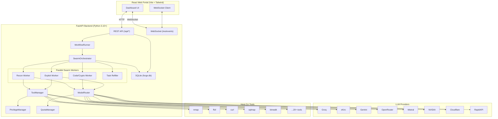
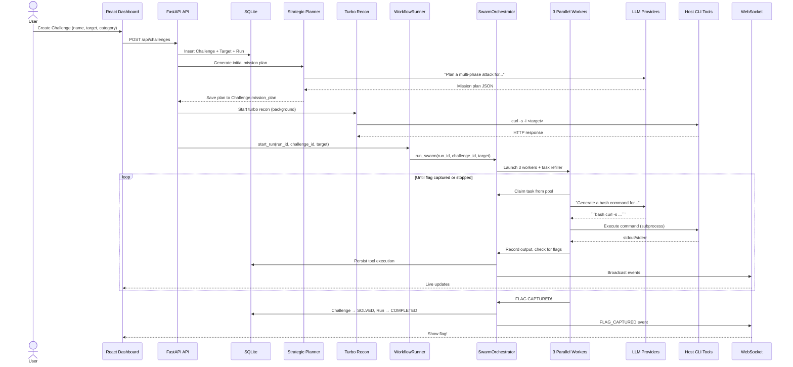

# FORGE — Technical Documentation & Problem Analysis

> **Version analysed**: codebase as of 2026-09-07  
> **Scope**: Full-stack architecture, data-flow walkthrough, subsystem inventory, and prioritised bug / debt list.

---

## 1. What Is FORGE?

FORGE (**F**ramework for **O**ffensive **R**econnaissance & **G**uided **E**xploitation) is a local, self-hosted **autonomous CTF (Capture-The-Flag) intelligence and exploitation command centre** built for the Ethiopian CyberShield 2026 Red Team competition.

It combines:
- A **FastAPI Python backend** that runs security tools, coordinates AI agents, and persists state to SQLite.
- A **React + TypeScript frontend** (built with Vite, styled with Tailwind CSS) served as a static bundle from the same FastAPI server on port `8000`.
- **Real-time WebSocket streaming** so the dashboard shows live tool output, AI decisions, flag captures, and worker telemetry.
- A **multi-provider AI router** that cascades across 10+ LLM providers (Groq, xKiro, Gemini, OpenRouter, Mistral, NVIDIA, Cloudflare, RapidAPI, etc.) with budget caps, quota tracking, and automatic failover.

The core workflow: a user registers a CTF challenge (name, category, target IP/URL), FORGE spawns a **parallel "swarm"** of 3 specialised AI agent workers (Recon, Code/Crypto, Exploit) that autonomously run security tools, analyse output, generate new tasks, and attempt to capture the flag — all visible in real-time on the web dashboard.

---

## 2. High-Level Architecture



---

## 3. Subsystem-by-Subsystem Breakdown

### 3.1 Entry Point & Server ([`launch_forge.py`](file:///c:/Users/habte/OneDrive/Documents/VS%20code/Project/Forge/launch_forge.py) → [`backend/main.py`](file:///c:/Users/habte/OneDrive/Documents/VS%20code/Project/Forge/backend/main.py))

| Responsibility | Detail |
|---|---|
| **Launcher** | Builds the React frontend (if `dist/` is absent), frees port 8000 if occupied, starts uvicorn. |
| **FastAPI app** | Mounts `/api` router, `/ws/events` WebSocket, and serves the compiled SPA at `/`. |
| **Startup hook** | Initialises the database, runs a stale-run sweep (`RUNNING` → `INTERRUPTED`) to clean zombie rows from crashed sessions. |
| **SPA Fallback** | A catch-all `/{full_path:path}` handler returns `index.html` for all non-API, non-WS, non-static routes (standard SPA routing). |

### 3.2 Configuration ([`backend/config.py`](file:///c:/Users/habte/OneDrive/Documents/VS%20code/Project/Forge/backend/config.py))

Dual-mode settings loader: uses `pydantic-settings` if available, otherwise falls back to raw `os.getenv()`. Holds 30+ environment variables for API keys (Gemini, OpenRouter, Groq, NVIDIA, Mistral, xKiro, RapidAPI, Cloudflare, AgentRouter per-model keys), database URL, budget caps, and CLI path overrides.

### 3.3 Database Layer ([`backend/database/`](file:///c:/Users/habte/OneDrive/Documents/VS%20code/Project/Forge/backend/database))

**ORM**: SQLAlchemy with a `declarative_base()`.  
**Engine**: SQLite by default, WAL journal mode, 30-second busy timeout, foreign keys ON.  
**Models** (10 tables):

| Model | Purpose |
|---|---|
| `ChallengeModel` | A CTF challenge (name, category, difficulty, status, flag, mission_plan JSON, progress %). |
| `TargetProfileModel` | Network target bound to a challenge (IP/URL, verification status). |
| `RunModel` | An autonomous execution run attached to a challenge. |
| `CheckpointModel` | State snapshots for resumable runs. |
| `ToolExecutionModel` | Every CLI command executed (stdout, stderr, exit code, duration). |
| `FindingModel` | Discovered vulnerabilities with severity and confidence. |
| `EvidenceModel` | Captured artifacts (HTTP responses, banners, flags, screenshots). |
| `ReportModel` | Generated Markdown writeup reports. |
| `KnowledgeEntryModel` | Ingested attack-pattern knowledge base entries. |
| `ProviderUsageModel` | LLM call cost/latency/token tracking. |
| `AuditLogModel` | Tamper-evident log of every privilege decision. |
| `ProviderConfigModel` | Provider health and configuration state. |

**Migration strategy**: Manual `ALTER TABLE ADD COLUMN` with silent exception swallowing in [`session.py`](file:///c:/Users/habte/OneDrive/Documents/VS%20code/Project/Forge/backend/database/session.py) — no Alembic.

### 3.4 REST API ([`backend/api/routes.py`](file:///c:/Users/habte/OneDrive/Documents/VS%20code/Project/Forge/backend/api/routes.py) — 1391 lines)

The monolithic API router exposes ~40 endpoints:

| Group | Key Endpoints |
|---|---|
| **System** | `GET /health`, `GET /environment`, `GET /system-requirements` |
| **Challenges** | CRUD (`POST/GET/DELETE /challenges`), `POST /challenges/{id}/start`, `POST /challenges/{id}/pause`, `POST /challenges/{id}/resume` |
| **Targets** | `PUT /targets/{id}/address`, `GET /challenges/{id}/targets` |
| **Runs** | `GET /challenges/{id}/runs`, `GET /runs/{id}/tool-executions` |
| **Evidence & Findings** | `POST /evidence`, `POST /findings`, `GET /challenges/{id}/evidence` |
| **Tools** | `POST /tools/execute`, `GET /tools/arsenal`, `POST /terminal/execute` |
| **AI Intelligence** | `GET /ai-intelligence`, `GET /ai-intelligence/{id}/audit-log` |
| **Providers** | `GET /providers/status`, `PUT /providers/{name}/key`, `POST /providers/register-snippet`, `POST /providers/test-connection` |
| **Reports** | `POST /reports/generate`, `GET /reports/{id}` |
| **Kill Switch** | `POST /kill-switch`, `POST /kill-switch/{run_id}` |
| **Settings** | `POST /settings` |

### 3.5 Workflow Runner ([`backend/api/runner.py`](file:///c:/Users/habte/OneDrive/Documents/VS%20code/Project/Forge/backend/api/runner.py))

Lightweight orchestrator that:
1. Determines execution engine (`swarm` or `orchestrator_loop`).
2. Resolves a safe working directory (via `workspace.py` allowlist).
3. Spawns the swarm as an `asyncio.Task` on the running event loop.
4. Maintains a kill-switch registry (per-run and global `__global__`).

### 3.6 Swarm Intelligence Engine ([`backend/agents/swarm_orchestrator.py`](file:///c:/Users/habte/OneDrive/Documents/VS%20code/Project/Forge/backend/agents/swarm_orchestrator.py) — 1268 lines)

The heart of FORGE. Key components:

#### SwarmBlackboard (Shared State)
An in-memory, `asyncio.Lock`-protected data structure shared by all workers:
- `discovered_endpoints`, `extracted_headers`, `observed_cookies`, `deobfuscated_secrets`
- `task_pool` — a dynamic priority queue of `SwarmTask` objects (`PENDING → CLAIMED → COMPLETED/FAILED`)
- `executed_commands_dedup` — prevents re-running the same command
- `tried_header_signatures` — prevents header injection loops
- `flag_captured` / `flag_candidates` / `flag_event` — flag lifecycle
- Periodic DB persistence of mission plan + progress (throttled to 3-second intervals)
- WebSocket broadcast of every state change (`PLAN_UPDATED`, `PROGRESS_UPDATED`, `AGENT_UPDATE`, `SWARM_BLACKBOARD_UPDATE`)

#### Three Parallel Workers
| Worker | Role | Preferred LLM | Task Categories |
|---|---|---|---|
| `_recon_worker` | Reconnaissance & fuzzing (curl, ffuf, httpx) | Groq Qwen 3.8-27b | `RECON` |
| `_code_crypto_worker` | Source analysis, ROT13/base64/hex decode, JWT inspection | Mistral Codestral | `CODE_AUDIT`, `CRYPTO_DECODE` |
| `_exploit_worker` | Payload construction, auth bypass, header injection | xKiro Qwen Coder | `EXPLOIT`, `PWN` |

Each worker loops: **claim task → ask LLM for a command → extract bash command → dedup check → execute via `tool_manager` → scan output for flags → record discoveries → complete task → repeat**.

#### Task Refiller
An infinite loop that re-seeds the task pool every 15 seconds when it drains, cycling through a round-robin list of exploratory prompts. The swarm never stops on its own — it runs until flag capture or operator pause/kill.

#### Flag Detection
- **Strict regex** (`FLAG_REGEX`) matching known CTF platform prefixes (picoCTF, HTB, etc.) with minimum 4 chars inside braces.
- **False-positive filter** (`FALSE_FLAG_PATTERNS`) rejecting `{...}`, `{example}`, `{your_flag}`, etc.
- **Critical rule**: flags are only scanned in **tool output** (`_check_tool_output_for_flags`), never in LLM prose.
- **Deterministic decode** (`_decode_artifacts`): ROT13, base64, hex — directly decodes captured artifacts without trusting the LLM.

#### Pause & Resume
- Pause: sets `pause_requested = True`, `is_stopped = True`, force-persists a snapshot.
- Resume: rehydrates the blackboard from `mission_plan.blackboard_state` + prior tool execution commands from the DB.

### 3.7 Model Router ([`backend/providers/router.py`](file:///c:/Users/habte/OneDrive/Documents/VS%20code/Project/Forge/backend/providers/router.py))

A capability-based multi-provider routing system:

1. **Routing Map**: 9 capabilities (recon, web_analysis, code_analysis, etc.) each mapped to an ordered list of ~10 providers.
2. **Model Provider Map**: ~40 model aliases mapped to `(provider_key, wire_model_id)` tuples.
3. **Routing Logic**: Try direct model → if refused/failed → cascade through capability chain → skip blacklisted/over-budget providers → return error if all exhausted.
4. **Cost Guard**: Paid providers rejected if `PAID_MODEL_ALLOWED=false` or daily budget exceeded.
5. **Provider Implementations** ([`real_providers.py`](file:///c:/Users/habte/OneDrive/Documents/VS%20code/Project/Forge/backend/providers/real_providers.py)):
   - `GeminiProvider` — Gemini REST API with multi-key rotation pool (up to 18 keys), safety settings `BLOCK_NONE`.
   - `OpenAISpecProvider` — Generic OpenAI-compatible client used for Groq, OpenRouter, NVIDIA, Mistral, xKiro, Cloudflare, RapidAPI.
   - `HuggingFaceProvider` — Hugging Face Inference API.
   - `CloudflareProvider` — Cloudflare Workers AI.
   - All use `httpx.AsyncClient` with follow-redirects.

### 3.8 Quota Manager ([`backend/providers/quota_manager.py`](file:///c:/Users/habte/OneDrive/Documents/VS%20code/Project/Forge/backend/providers/quota_manager.py))

Handles AgentRouter's batch quota system:
- Tracks 402 (quota exhaustion) and 429 (rate limit) per provider.
- Time-limited circuit breaker: 5 min for 429s, 30 min for 402s, 60 min for 401s.
- Batch replenishment aware: UTC 23:00 and 11:00 (Beijing 07:00 and 19:00).
- Claude/GPT models restricted to a 3-hour post-reset window.

### 3.9 Tool System ([`backend/tools/`](file:///c:/Users/habte/OneDrive/Documents/VS%20code/Project/Forge/backend/tools))

| Component | Purpose |
|---|---|
| **ToolRegistry** | Declares 5 pre-approved tools (nmap, ffuf, curl, strings, binwalk) with capabilities, binaries, install recipes, and timeout. |
| **ToolManager** | Resolves capability → installed tool → constructs safe command → `asyncio.create_subprocess_shell` with timeout → returns `ToolExecutionResult`. Also supports raw `bash`/`sh` command execution. |

### 3.10 Supporting Subsystems

| Module | Purpose |
|---|---|
| [`privilege/manager.py`](file:///c:/Users/habte/OneDrive/Documents/VS%20code/Project/Forge/backend/privilege/manager.py) | Evaluates SAFE/PRIVILEGED/DANGEROUS and logs audit trail. Currently auto-approves SAFE, rejects everything else. |
| [`websocket/manager.py`](file:///c:/Users/habte/OneDrive/Documents/VS%20code/Project/Forge/backend/websocket/manager.py) | Simple broadcast hub holding a list of active WebSocket connections. |
| [`environment/detector.py`](file:///c:/Users/habte/OneDrive/Documents/VS%20code/Project/Forge/backend/environment/detector.py) | Discovers OS, hardware, installed tools (PATH resolution), and Python libraries. |
| [`utils/workspace.py`](file:///c:/Users/habte/OneDrive/Documents/VS%20code/Project/Forge/backend/utils/workspace.py) | Safe working-directory resolution with allowlist to prevent accidental deletion of the project root (a past critical bug). |
| [`recon/turbo_recon.py`](file:///c:/Users/habte/OneDrive/Documents/VS%20code/Project/Forge/backend/recon/turbo_recon.py) | Pre-warmed fast recon (curl probe + header/endpoint extraction) run immediately on challenge creation. |
| [`knowledge/playbook_vault.py`](file:///c:/Users/habte/OneDrive/Documents/VS%20code/Project/Forge/backend/knowledge/playbook_vault.py) | Ingests CTF writeups and HackTricks playbooks into a searchable knowledge base. |
| [`agents/strategic_planner.py`](file:///c:/Users/habte/OneDrive/Documents/VS%20code/Project/Forge/backend/agents/strategic_planner.py) | Generates an initial multi-phase mission plan via LLM before the swarm starts. |
| [`agents/orchestrator_loop.py`](file:///c:/Users/habte/OneDrive/Documents/VS%20code/Project/Forge/backend/agents/orchestrator_loop.py) | Legacy single-agent ReAct loop (alternative engine, largely superseded by swarm). |
| [`engine/keep_awake.py`](file:///c:/Users/habte/OneDrive/Documents/VS%20code/Project/Forge/backend/engine/keep_awake.py) | Prevents OS sleep during active swarm runs. |
| [`reporting/generator.py`](file:///c:/Users/habte/OneDrive/Documents/VS%20code/Project/Forge/backend/reporting/generator.py) | Generates Markdown CTF writeup reports post-run. |

### 3.11 Frontend (React + TypeScript + Tailwind)

| File | Role |
|---|---|
| [`App.tsx`](file:///c:/Users/habte/OneDrive/Documents/VS%20code/Project/Forge/frontend/src/App.tsx) (36KB) | Monolithic single-file app containing all pages, components, routing, and state management. |
| [`types.ts`](file:///c:/Users/habte/OneDrive/Documents/VS%20code/Project/Forge/frontend/src/types.ts) | TypeScript interfaces for challenges, runs, targets, evidence, etc. |
| [`services/`](file:///c:/Users/habte/OneDrive/Documents/VS%20code/Project/Forge/frontend/src/services) | API client layer. |
| [`components/`](file:///c:/Users/habte/OneDrive/Documents/VS%20code/Project/Forge/frontend/src/components) | Reusable UI components. |

---

## 4. Data Flow: Challenge Lifecycle



---

## 5. Current Problems & Technical Debt

### 🔴 Critical

| # | Problem | Location | Impact |
|---|---|---|---|
| **C1** | **Arbitrary command execution with zero sandboxing** — the swarm workers execute any bash command the LLM generates via `asyncio.create_subprocess_shell()` with no sandboxing, no allowlist, and no privilege check. The `PrivilegeManager` exists but is **never called** by the swarm workers or `ToolManager.execute_raw_command()`. An adversarial LLM response (or prompt injection via a CTF challenge page) could run `rm -rf /`, exfiltrate keys, or install a backdoor. | [`tool manager`](file:///c:/Users/habte/OneDrive/Documents/VS%20code/Project/Forge/backend/tools/manager.py#L153-L207), [`swarm workers`](file:///c:/Users/habte/OneDrive/Documents/VS%20code/Project/Forge/backend/agents/swarm_orchestrator.py#L826-L1175) | **Security**: Remote code execution via LLM prompt injection. |
| **C2** | **`datetime.utcnow()` used everywhere** — deprecated since Python 3.12, returns a naive datetime (no timezone). Some code uses `datetime.now(timezone.utc)` (timezone-aware) in the same file, creating comparison bugs between aware and naive datetimes. SQLAlchemy column defaults use the naive variant. | [`models.py`](file:///c:/Users/habte/OneDrive/Documents/VS%20code/Project/Forge/backend/database/models.py), [`routes.py`](file:///c:/Users/habte/OneDrive/Documents/VS%20code/Project/Forge/backend/api/routes.py#L341) | **Correctness**: Mixed aware/naive datetime comparisons can crash or produce wrong results. |
| **C3** | **`shell=True` subprocess calls with user-influenced input** — `execute_raw_command()` and `execute_capability()` pass strings through `create_subprocess_shell()`. Even though the LLM generates commands (not direct user input), the target URL/IP is user-provided and interpolated into commands via `args_template.format(target=...)`, enabling shell injection if the target string contains `;`, `|`, or backticks. | [`manager.py`](file:///c:/Users/habte/OneDrive/Documents/VS%20code/Project/Forge/backend/tools/manager.py#L111-L116) | **Security**: Shell injection via crafted target addresses. |
| **C4** | **CORS fully open** (`allow_origins=["*"]`, `allow_credentials=True`) — any website can make authenticated API requests to FORGE, including triggering the kill switch, creating challenges, or executing commands. | [`main.py`](file:///c:/Users/habte/OneDrive/Documents/VS%20code/Project/Forge/backend/main.py#L33-L39) | **Security**: Cross-site request forgery on local network. |

---

### 🟡 Major

| # | Problem | Location | Impact |
|---|---|---|---|
| **M1** | **Giant monolithic files** — [`swarm_orchestrator.py`](file:///c:/Users/habte/OneDrive/Documents/VS%20code/Project/Forge/backend/agents/swarm_orchestrator.py) is 1268 lines; [`routes.py`](file:///c:/Users/habte/OneDrive/Documents/VS%20code/Project/Forge/backend/api/routes.py) is 1391 lines; [`App.tsx`](file:///c:/Users/habte/OneDrive/Documents/VS%20code/Project/Forge/frontend/src/App.tsx) is 36KB in a single file. Extremely hard to maintain, test, or review. | Multiple | **Maintainability**: High cognitive load, merge conflicts, no separation of concerns. |
| **M2** | **No database migrations** — new columns are added via `ALTER TABLE` wrapped in bare `except Exception: pass`. If a migration partially fails, there is no rollback, no visibility, and no way to know what schema state the DB is in. | [`session.py`](file:///c:/Users/habte/OneDrive/Documents/VS%20code/Project/Forge/backend/database/session.py#L39-L101) | **Reliability**: Silent schema corruption, impossible to track schema version. |
| **M3** | **SQLite under concurrent writes** — the swarm runs 3+ async workers all writing `ToolExecutionModel` rows, plus the API serving reads simultaneously. WAL mode and `busy_timeout=30s` mitigate but don't eliminate `SQLITE_BUSY` under heavy load. The `except Exception: pass` around persistence calls (e.g. [`record_tool_execution`](file:///c:/Users/habte/OneDrive/Documents/VS%20code/Project/Forge/backend/agents/swarm_orchestrator.py#L498-L525)) silently swallows DB lock errors. | `swarm_orchestrator.py`, `session.py` | **Data Loss**: Tool executions silently dropped when DB is contended. |
| **M4** | **`SessionLocal()` creates a new session per call with no pooling or context-manager pattern** — every `SessionLocal()` call creates a new `sessionmaker()` factory AND a new session. The session is manually closed with `db.close()` but no `try/finally` in some call sites, risking leaked connections. | [`session.py`](file:///c:/Users/habte/OneDrive/Documents/VS%20code/Project/Forge/backend/database/session.py#L31-L33) | **Resource Leak**: Connection leaks, inefficient session creation. |
| **M5** | **API keys potentially in `.env` checked into repo** — `.env` is 2509 bytes and present in the working tree. The `.gitignore` likely has it, but the file exists alongside `forge.db` (production database) in the repo root. | Project root | **Security**: Credential exposure risk. |
| **M6** | **Hardcoded confidence scores** — AI decision events broadcast hardcoded `"confidence": 92` / `95` / `90` regardless of actual model confidence. | [`swarm_orchestrator.py`](file:///c:/Users/habte/OneDrive/Documents/VS%20code/Project/Forge/backend/agents/swarm_orchestrator.py#L888) | **UX Deception**: Dashboard shows fake confidence numbers. |
| **M7** | **No authentication or authorization** — anyone on the same network can access the full API, create challenges, execute arbitrary commands, and read evidence. | All API endpoints | **Security**: Zero access control on a tool that runs as root-capable shell commands. |
| **M8** | **`on_event("startup")` is deprecated in modern FastAPI** — should use `lifespan` context manager. | [`main.py`](file:///c:/Users/habte/OneDrive/Documents/VS%20code/Project/Forge/backend/main.py#L66-L71) | **Compatibility**: Will emit deprecation warnings, will break in future FastAPI versions. |

---

### 🟢 Minor / Improvement Opportunities

| # | Problem | Location | Impact |
|---|---|---|---|
| **m1** | **Tool registry only declares 5 tools** but README claims 25 — nmap, ffuf, curl, strings, binwalk are registered; all others (sqlmap, john, hashcat, hydra, etc.) exist only as environment detector checks and install recipes. If the swarm's LLM generates an `sqlmap` command, it falls through to `execute_raw_command()` (arbitrary shell exec) instead of the safe capability-based path. | [`registry.py`](file:///c:/Users/habte/OneDrive/Documents/VS%20code/Project/Forge/backend/tools/registry.py) | **Correctness**: Feature mismatch with documentation. |
| **m2** | **Default secret key** `forge-secret-key-change-in-production` is a classic insecure default. | [`config.py`](file:///c:/Users/habte/OneDrive/Documents/VS%20code/Project/Forge/backend/config.py#L17) | **Security**: Weak default secret. |
| **m3** | **Wordlist fallback creates a tiny 10-entry file** if seclists/dirb are missing — ffuf brute-force with 10 words is effectively useless. | [`manager.py`](file:///c:/Users/habte/OneDrive/Documents/VS%20code/Project/Forge/backend/tools/manager.py#L89-L97) | **Effectiveness**: Directory enumeration will find almost nothing with this wordlist. |
| **m4** | **`asyncio.create_task()` fire-and-forget everywhere** — WebSocket broadcasts, flag candidate recording, and other operations are wrapped in `asyncio.create_task()` with no reference saved and no error handler, so exceptions are silently lost. | Multiple files | **Debuggability**: Errors vanish without a trace. |
| **m5** | **No unit tests for the swarm** — the `tests/` directory exists but the 29 passing tests (per README) don't cover the swarm orchestrator, which is the most complex and critical subsystem. | `tests/` | **Quality**: Core logic untested. |
| **m6** | **Linux-centric tool paths and assumptions** — wordlist paths (`/usr/share/seclists/...`), `fuser -k`, `sudo apt-get` — but the project is being developed and run on Windows. | `manager.py`, `launch_forge.py`, README | **Portability**: Won't work as-is on the dev platform. |
| **m7** | **`requirements.txt` is only 279 bytes** — likely missing dependencies (httpx, pydantic, psutil, etc.). | [`requirements.txt`](file:///c:/Users/habte/OneDrive/Documents/VS%20code/Project/Forge/backend/requirements.txt) | **Reproducibility**: Incomplete dependency specification. |
| **m8** | **Engine cache never invalidated** — `_engine_cache` in `session.py` caches engines by URL string but never clears them, even if `DATABASE_URL` changes at runtime. | [`session.py`](file:///c:/Users/habte/OneDrive/Documents/VS%20code/Project/Forge/backend/database/session.py#L7-L29) | **Correctness**: Stale engine if DB URL is hot-swapped. |
| **m9** | **`except Exception: pass` used ~30+ times** — errors in persistence, WebSocket broadcasts, report generation, recon, and migrations are all silently swallowed. | Multiple | **Debuggability**: Silent failures make troubleshooting nearly impossible. |
| **m10** | **Mixed `\r\n` and `\n` line endings** — `swarm_orchestrator.py` uses Windows CRLF while other files use Unix LF. | `swarm_orchestrator.py` | **Code Quality**: Inconsistent line endings cause noisy diffs. |

---

## 6. Dependency Map

```
Python Backend:
  fastapi, uvicorn, sqlalchemy, pydantic, pydantic-settings,
  python-dotenv, httpx, psutil

Frontend:
  react 18, react-dom 18, lucide-react (icons)
  vite 5, typescript 5, tailwindcss 3, postcss, autoprefixer

Host Tools (runtime):
  nmap, ffuf, curl, strings, binwalk (+20 optional)

LLM APIs (external):
  Groq, Gemini, OpenRouter, xKiro, Mistral, NVIDIA NIM,
  Cloudflare Workers AI, RapidAPI, HuggingFace
```

---

## 7. File Tree Summary

```
Forge/
├── launch_forge.py            # Single-command launcher
├── start.bat                  # Windows batch launcher
├── .env / .env.example        # Configuration
├── forge.db                   # Production SQLite DB
│
├── backend/
│   ├── main.py                # FastAPI app entry
│   ├── config.py              # Settings loader
│   ├── database/
│   │   ├── models.py          # 11 SQLAlchemy models
│   │   └── session.py         # Engine, session factory, migrations
│   ├── api/
│   │   ├── routes.py          # ~40 REST endpoints (1391 lines)
│   │   └── runner.py          # Workflow launcher & kill switch
│   ├── agents/
│   │   ├── swarm_orchestrator.py   # Core swarm engine (1268 lines)
│   │   ├── orchestrator_loop.py    # Legacy ReAct loop
│   │   ├── strategic_planner.py    # Pre-flight plan generator
│   │   ├── stream_condenser.py     # Output summarisation
│   │   ├── cli_agent_runner.py     # CLI agent integration
│   │   └── manager.py             # Agent manager
│   ├── providers/
│   │   ├── router.py          # Multi-provider LLM router
│   │   ├── real_providers.py  # Gemini, OpenAI-spec, HF, CF providers
│   │   ├── quota_manager.py   # AgentRouter quota tracking
│   │   ├── snippet_parser.py  # Provider registration from snippets
│   │   ├── base.py            # Provider ABC
│   │   └── live_providers.py  # Live provider status
│   ├── tools/
│   │   ├── manager.py         # Tool execution engine
│   │   └── registry.py        # Capability-to-tool mapping
│   ├── privilege/manager.py   # Privilege evaluation & audit
│   ├── websocket/manager.py   # WebSocket broadcast hub
│   ├── environment/detector.py # OS & tool detection
│   ├── engine/keep_awake.py   # OS sleep prevention
│   ├── recon/turbo_recon.py   # Fast pre-flight recon
│   ├── knowledge/             # Playbook vault & ingestion
│   ├── reporting/generator.py # Writeup report generator
│   └── utils/
│       ├── workspace.py       # Safe path resolution
│       └── git_security_scanner.py
│
├── frontend/
│   ├── src/
│   │   ├── App.tsx            # Monolithic React app (36KB)
│   │   ├── types.ts           # TypeScript interfaces
│   │   ├── index.css          # Global styles
│   │   ├── main.tsx           # React entry
│   │   ├── components/        # UI components
│   │   ├── services/          # API client
│   │   ├── data/              # Static data
│   │   └── utils/             # Frontend utilities
│   ├── package.json           # React/Vite/Tailwind deps
│   └── dist/                  # Compiled production build
│
├── tests/                     # Test suite
├── scripts/                   # Utility scripts
├── reports/                   # Generated reports
├── logs/                      # Runtime logs
└── hacktricks/                # Knowledge base source
```

---

## 8. Summary

FORGE is an ambitious, feature-rich autonomous CTF framework with a sophisticated multi-provider LLM orchestration layer, a parallel swarm architecture, real-time WebSocket dashboard, and resilient state persistence. Its core value proposition — "register a challenge, let AI solve it" — is well-implemented at the application logic level.

However, the project carries significant **security debt** (unsandboxed shell execution, no auth, open CORS, shell injection vectors) and **engineering debt** (monolithic files, no migrations, silent error swallowing, incomplete tool registry, hardcoded confidence scores). The security issues are particularly concerning given that the tool's entire purpose is to execute commands on the host machine based on LLM-generated instructions and content from untrusted CTF challenge pages.

> [!CAUTION]
> The combination of **C1** (unsandboxed LLM-controlled command execution) + **C3** (shell injection via target addresses) + **C4** (open CORS) + **M7** (no auth) means that any website visited in the same browser session could instruct FORGE to execute arbitrary commands on the host machine. This should be the #1 priority fix.
